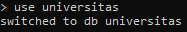
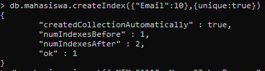
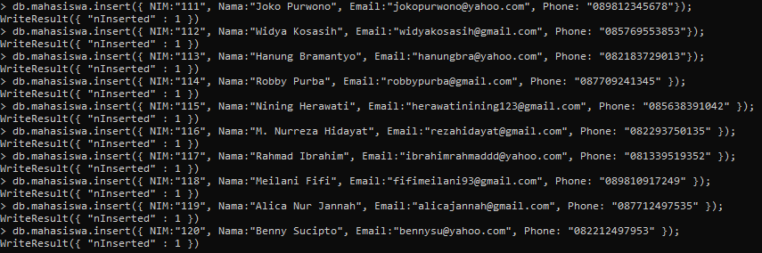
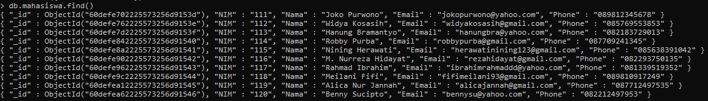
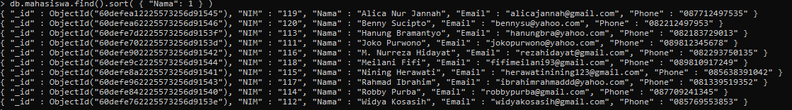
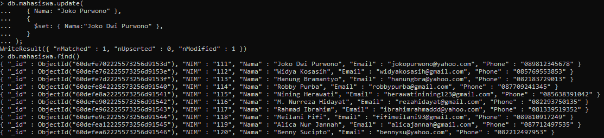
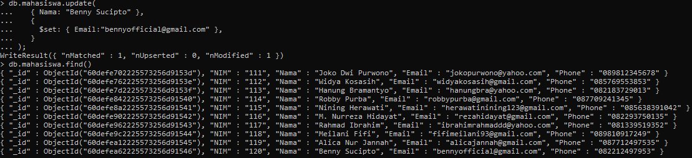

# Study_Kasus_MongoDB

### 1. Buat database universitas
```mongodb
use universitas;
```



### 2. Membuat field key unik untuk email dengan perintah:
```mongodb
db.mahasiswa.createIndex({"Email":10},{unique:true})
```



### 3. Input 10 data pada collection mahasiswa
```mongodb
db.mahasiswa.insert({ NIM:"111", Nama:"Joko Purwono", Email:"jokopurwono@yahoo.com", Phone: "089812345678"});
db.mahasiswa.insert({ NIM:"112", Nama:"Widya Kosasih", Email:"widyakosasih@gmail.com", Phone: "085769553853"});
db.mahasiswa.insert({ NIM:"113", Nama:"Hanung Bramantyo", Email:"hanungbra@yahoo.com", Phone: "082183729013"});
db.mahasiswa.insert({ NIM:"114", Nama:"Robby Purba", Email:"robbypurba@gmail.com", Phone: "087709241345" });
db.mahasiswa.insert({ NIM:"115", Nama:"Nining Herawati", Email:"herawatinining123@gmail.com", Phone: "085638391042" });
db.mahasiswa.insert({ NIM:"116", Nama:"M. Nurreza Hidayat", Email:"rezahidayat@gmail.com", Phone: "082293750135" });
db.mahasiswa.insert({ NIM:"117", Nama:"Rahmad Ibrahim", Email:"ibrahimrahmaddd@yahoo.com", Phone: "081339519352" });
db.mahasiswa.insert({ NIM:"118", Nama:"Meilani Fifi", Email:"fifimeilani93@gmail.com", Phone: "089810917249" });
db.mahasiswa.insert({ NIM:"119", Nama:"Alica Nur Jannah", Email:"alicajannah@gmail.com", Phone: "087712497535" });
db.mahasiswa.insert({ NIM:"120", Nama:"Benny Sucipto", Email:"bennysu@yahoo.com", Phone: "082212497953" });
```



### cek data yang sudah diinputkan apakah sudah masuk atau belum.
```mongodb
db.mahasiswa.find()
```



### 4. Tampilkan data dari tabel mahasiswa berdasarkan nama mahasiswa secara alphabet.
```mongodb
db.mahasiswa.find().sort( { "Nama": 1 } )
```



### 5. Ubah nama Joko Purwono menjadi Joko Dwi Purwono
```mongodb
db.mahasiswa.update(
   { Nama: "Joko Purwono" },
   {
     $set: { Nama:"Joko Dwi Purwono" },
   }
);
```



### 6. Ubah email atas nama Benny Sucipto menjadi bennyofficial@gmail.com
```mongodb
db.mahasiswa.update(
   { Nama: "Benny Sucipto" },
   {
     $set: { Email:"bennyofficial@gmail.com" },
   }
);
```

